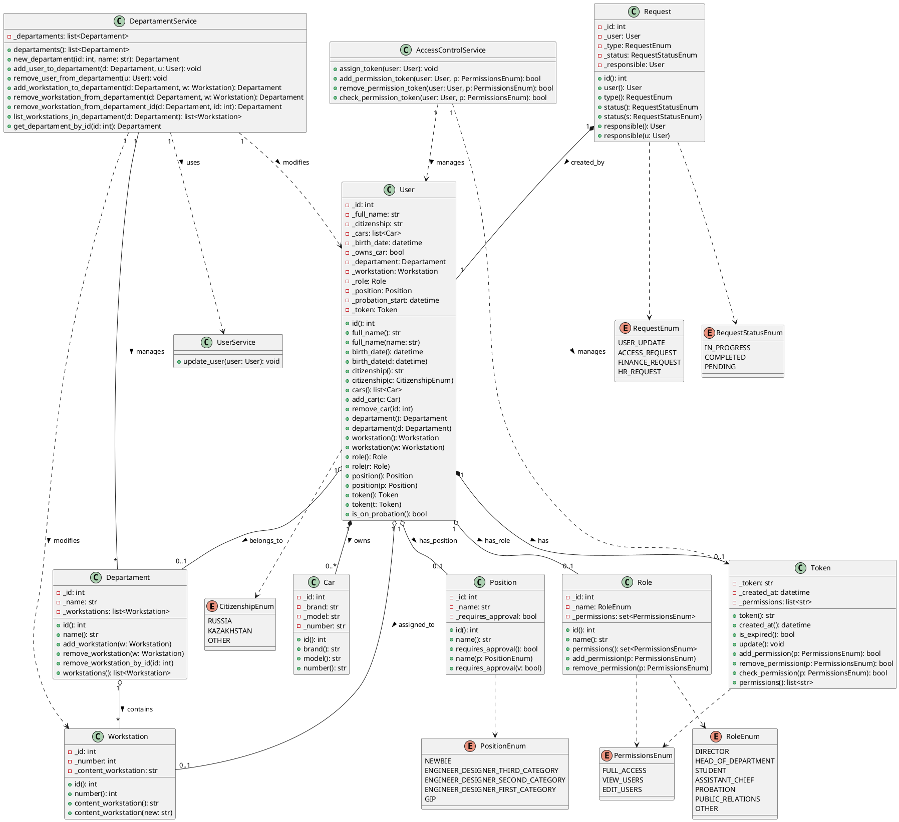

```plantuml
@startuml SmartBot_Full_Diagram

' --- ENUMS ---
enum CitizenshipEnum {
  RUSSIA
  KAZAKHSTAN
  OTHER
}

enum PermissionsEnum {
  FULL_ACCESS
  VIEW_USERS
  EDIT_USERS
}

enum PositionEnum {
  NEWBIE
  ENGINEER_DESIGNER_THIRD_CATEGORY
  ENGINEER_DESIGNER_SECOND_CATEGORY
  ENGINEER_DESIGNER_FIRST_CATEGORY
  GIP
}

enum RoleEnum {
  DIRECTOR
  HEAD_OF_DEPARTMENT
  STUDENT
  ASSISTANT_CHIEF
  PROBATION
  PUBLIC_RELATIONS
  OTHER
}

enum RequestEnum {
  USER_UPDATE
  ACCESS_REQUEST
  FINANCE_REQUEST
  HR_REQUEST
}

enum RequestStatusEnum {
  IN_PROGRESS
  COMPLETED
  PENDING
}

' --- DOMAIN CLASSES ---
class Car {
  - _id: int
  - _brand: str
  - _model: str
  - _number: str
  + id(): int
  + brand(): str
  + model(): str
  + number(): str
}

class Workstation {
  - _id: int
  - _number: int
  - _content_workstation: str
  + id(): int
  + number(): int
  + content_workstation(): str
  + content_workstation(new: str)
}

class Departament {
  - _id: int
  - _name: str
  - _workstations: list<Workstation>
  + id(): int
  + name(): str
  + add_workstation(w: Workstation)
  + remove_workstation(w: Workstation)
  + remove_workstation_by_id(id: int)
  + workstations(): list<Workstation>
}

class Position {
  - _id: int
  - _name: str
  - _requires_approval: bool
  + id(): int
  + name(): str
  + requires_approval(): bool
  + name(p: PositionEnum)
  + requires_approval(v: bool)
}

class Role {
  - _id: int
  - _name: RoleEnum
  - _permissions: set<PermissionsEnum>
  + id(): int
  + name(): str
  + permissions(): set<PermissionsEnum>
  + add_permission(p: PermissionsEnum)
  + remove_permission(p: PermissionsEnum)
}

class Token {
  - _token: str
  - _created_at: datetime
  - _permissions: list<str>
  + token(): str
  + created_at(): datetime
  + is_expired(): bool
  + update(): void
  + add_permission(p: PermissionsEnum): bool
  + remove_permission(p: PermissionsEnum): bool
  + check_permission(p: PermissionsEnum): bool
  + permissions(): list<str>
}

class Request {
  - _id: int
  - _user: User
  - _type: RequestEnum
  - _status: RequestStatusEnum
  - _responsible: User
  + id(): int
  + user(): User
  + type(): RequestEnum
  + status(): RequestStatusEnum
  + status(s: RequestStatusEnum)
  + responsible(): User
  + responsible(u: User)
}

class User {
  - _id: int
  - _full_name: str
  - _citizenship: str
  - _cars: list<Car>
  - _birth_date: datetime
  - _owns_car: bool
  - _departament: Departament
  - _workstation: Workstation
  - _role: Role
  - _position: Position
  - _probation_start: datetime
  - _token: Token
  + id(): int
  + full_name(): str
  + full_name(name: str)
  + birth_date(): datetime
  + birth_date(d: datetime)
  + citizenship(): str
  + citizenship(c: CitizenshipEnum)
  + cars(): list<Car>
  + add_car(c: Car)
  + remove_car(id: int)
  + departament(): Departament
  + departament(d: Departament)
  + workstation(): Workstation
  + workstation(w: Workstation)
  + role(): Role
  + role(r: Role)
  + position(): Position
  + position(p: Position)
  + token(): Token
  + token(t: Token)
  + is_on_probation(): bool
}

' --- SERVICE CLASSES ---
class AccessControlService {
  + assign_token(user: User): void
  + add_permission_token(user: User, p: PermissionsEnum): bool
  + remove_permission_token(user: User, p: PermissionsEnum): bool
  + check_permission_token(user: User, p: PermissionsEnum): bool
}

class DepartamentService {
  - _departaments: list<Departament>
  + departaments(): list<Departament>
  + new_departament(id: int, name: str): Departament
  + add_user_to_departament(d: Departament, u: User): void
  + remove_user_from_departament(u: User): void
  + add_workstation_to_departament(d: Departament, w: Workstation): Departament
  + remove_workstation_from_departament(d: Departament, w: Workstation): Departament
  + remove_workstation_from_departament_id(d: Departament, id: int): Departament
  + list_workstations_in_departament(d: Departament): list<Workstation>
  + get_departament_by_id(id: int): Departament
}

class UserService {
  + update_user(user: User): void
}

' --- ASSOCIATIONS ---
User "1" *-- "0..*" Car           : owns >
User "1" *-- "0..1" Token         : has >
User "1" o-- "0..1" Departament   : belongs_to >
User "1" o-- "0..1" Workstation   : assigned_to >
User "1" o-- "0..1" Role          : has_role >
User "1" o-- "0..1" Position      : has_position >
Departament "1" o-- "*" Workstation : contains >
Request "1" *-- "1" User           : created_by >

DepartamentService "1" -- "*" Departament : manages >
DepartamentService "1" ..> UserService   : uses >
DepartamentService "1" ..> User          : modifies >
DepartamentService "1" ..> Workstation    : modifies >

AccessControlService "1" ..> User   : manages >
AccessControlService "1" ..> Token  : manages >

' --- DEPENDENCIES TO ENUMS ---
User ..> CitizenshipEnum
Role ..> RoleEnum
Role ..> PermissionsEnum
Position ..> PositionEnum
Token ..> PermissionsEnum
Request ..> RequestEnum
Request ..> RequestStatusEnum

@enduml

```
	