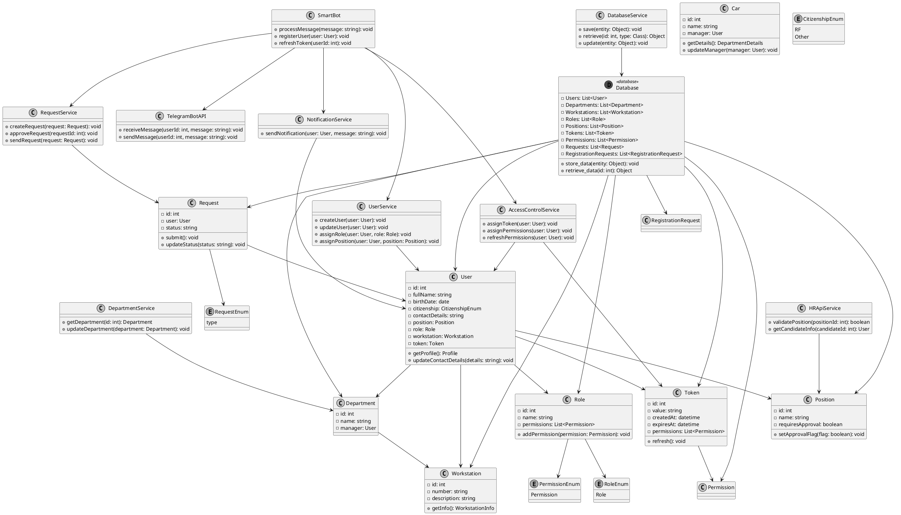

```plantuml
@startuml
skinparam monochrome true

' ==== Сущности (Entities) ====

class User {
  -id: int
  -fullName: string
  -birthDate: date
  -citizenship: CitizenshipEnum
  -contactDetails: string
  -position: Position
  -role: Role
  -workstation: Workstation
  -token: Token
  +getProfile(): Profile
  +updateContactDetails(details: string): void
}

class Department {
  -id: int
  -name: string
  -manager: User
}

class Car {
  -id: int
  -name: string
  -manager: User
  +getDetails(): DepartmentDetails
  +updateManager(manager: User): void
}

class Workstation {
  -id: int
  -number: string
  -description: string
  +getInfo(): WorkstationInfo
}

class Role {
  -id: int
  -name: string
  -permissions: List<Permission>
  +addPermission(permission: Permission): void
}

class Position {
  -id: int
  -name: string
  -requiresApproval: boolean
  +setApprovalFlag(flag: boolean): void
}

class Token {
  -id: int
  -value: string
  -createdAt: datetime
  -expiresAt: datetime
  -permissions: List<Permission>
  +refresh(): void
}


class Request {
  -id: int
  -user: User
  -status: string
  +submit(): void
  +updateStatus(status: string): void
}

enum RequestEnum {
  type
}

enum PermissionEnum {
  Permission
}

enum RoleEnum {
  Role
}

enum CitizenshipEnum {
  RF
  Other
}

' ==== Сервисы (Services) ====

class UserService {
  +createUser(user: User): void
  +updateUser(user: User): void
  +assignRole(user: User, role: Role): void
  +assignPosition(user: User, position: Position): void
}

class RequestService {
  +createRequest(request: Request): void
  +approveRequest(requestId: int): void
  +sendRequest(request: Request): void
}

class DepartmentService {
  +getDepartment(id: int): Department
  +updateDepartment(department: Department): void
}

class AccessControlService {
  +assignToken(user: User): void
  +assignPermissions(user: User): void
  +refreshPermissions(user: User): void
}

class NotificationService {
  +sendNotification(user: User, message: string): void
}

class HRApiService {
  +validatePosition(positionId: int): boolean
  +getCandidateInfo(candidateId: int): User
}

class DatabaseService {
  +save(entity: Object): void
  +retrieve(id: int, type: Class): Object
  +update(entity: Object): void
}

class TelegramBotAPI {
  +receiveMessage(userId: int, message: string): void
  +sendMessage(userId: int, message: string): void
}

class SmartBot {
  +processMessage(message: string): void
  +registerUser(user: User): void
  +refreshToken(userId: int): void
}


' ==== Хранилище (Database) ====

class Database << (D, #FF0000) database >> {
  -Users: List<User>
  -Departments: List<Department>
  -Workstations: List<Workstation>
  -Roles: List<Role>
  -Positions: List<Position>
  -Tokens: List<Token>
  -Permissions: List<Permission>
  -Requests: List<Request>
  -RegistrationRequests: List<RegistrationRequest>
  +store_data(entity: Object): void
  +retrieve_data(id: int): Object
}


' ==== Связи ====

' Сущности
User --> Department
Request --> User
User --> Role
User --> Position
User --> Token
User --> Workstation

Role --> PermissionEnum
Role --> RoleEnum
Token --> Permission
Department --> Workstation
Request --> RequestEnum

' Сервисы и сущности
UserService --> User
RequestService --> Request
DepartmentService --> Department
AccessControlService --> User
AccessControlService --> Token
NotificationService --> User
HRApiService --> Position
DatabaseService --> Database

SmartBot --> TelegramBotAPI
SmartBot --> UserService
SmartBot --> RequestService
SmartBot --> NotificationService
SmartBot --> AccessControlService

Database --> User
Database --> Department
Database --> Workstation
Database --> Role
Database --> Position
Database --> Token
Database --> Permission
Database --> Request
Database --> RegistrationRequest

@enduml
```

